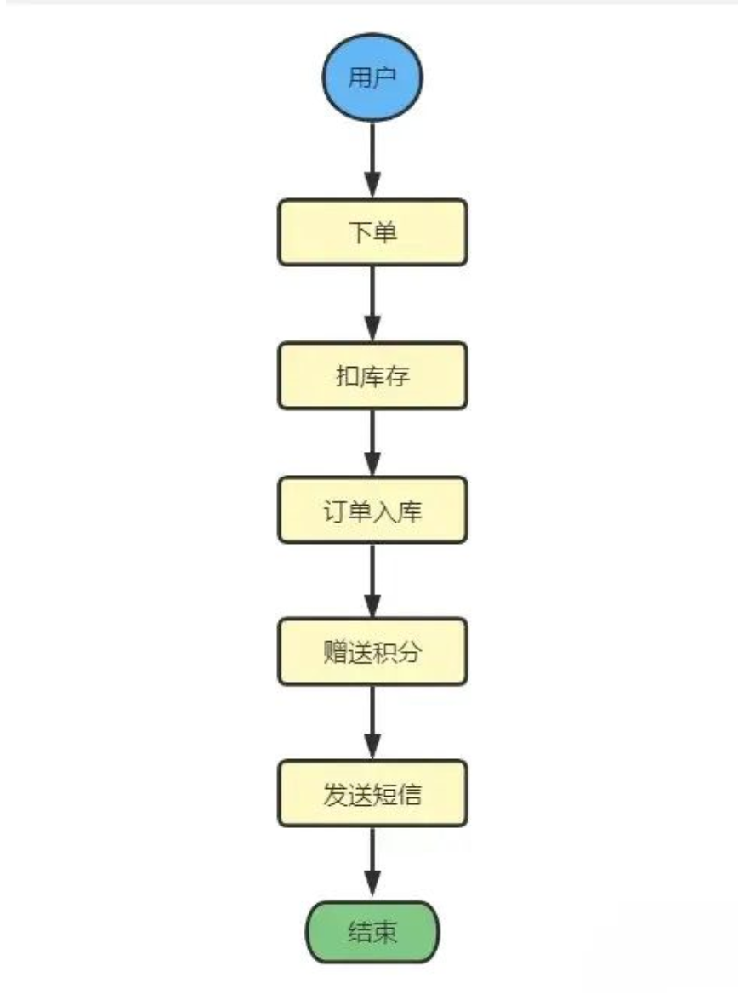
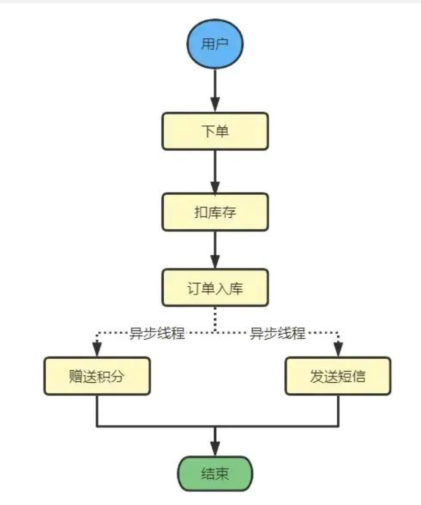

# Java实现异步编程

## 前言

在开发过程中，异步很常见。相比同步执行，异步可以提升执行效率，大大降低请求链路时间，提升用户体验。 比如在发送短信、发送邮件等业务场景中可以用到异步。


## 什么是异步？

通过一个例子来解释：

假如有如下应用场景



这个业务逻辑线是同步执行， 意味着 发送短信 这一步需要在赠送积分成功过后才会执行。 这就是同步执行的例子。

实际上，发送短信和赠送积分可能没有依赖关系，可以将这两步操作同时执行，提升效率。这就是典型的异步执行。



## 在Java中，如何异步编程

本文介绍如下8种方式：

1. Thread
2. Future
3. 异步框架CompletableFuture
4. Spring注解@Async
5. SpringApplicationEvent事件
6. 消息队列
7. 其他异步框架
8. Guava异步


### Thread线程异步

通过Thread实现线程异步有两种方式：

1. extends  Thread

   ```java
   public class ThreadTest extends Thread {
   
       public static void main(String[] args) {
           System.out.println("thread " + Thread.currentThread() + " running ");
           ThreadTest threadTest = new ThreadTest();
           threadTest.start();
       }
   
       @Override
       public void run() {
           System.out.println("thread " + Thread.currentThread() + " running ");
       }
   }
   
   ---
   输出结果：
   thread Thread[main,5,main] running 
   thread Thread[Thread-0,5,main] running 
   ```

   

2. implements Runnable

   ```java
   public class RunnableTest {
       public static void main(String[] args) {
           System.out.println("thread " + Thread.currentThread() + " running ");
           new Thread(new RunnableImpl()).start();
       }
   }
   
   class RunnableImpl implements Runnable {
       @Override
       public void run() {
           System.out.println("thread " + Thread.currentThread() + " running ");
       }
   }
   ```

   其他写法

   ```java
   // java8后 Lambda表达式
   public static void main(String[] args) {
           System.out.println("thread " + Thread.currentThread() + " running ");
           new Thread(
               () -> System.out.println("thread " + Thread.currentThread() +  " running")
           ).start();
   }
   
   // 匿名内部类
   public static void main(String[] args) {
           System.out.println("thread " + Thread.currentThread() + " running ");
           new Thread(new Runnable() {
               @Override
               public void run() {
                   System.out.println("thread " + Thread.currentThread() + " running ");
               }
           }).start();
   }
   ```

   以上的功能是一样的，采取合适的方式即可。

   需要注意的是，这样反复开启、销毁线程会消耗系统资源，可以使用线程池代替

3. 使用线程池实现

   ```java
   private static final Executor executor = Executors.newCachedThreadPool();
   
   public static void main(String[] args) {
       executor.execute(() -> {
           // do something
       });
   }
   ```

   

### Future

```java
public class FutureTest {

    public static void main(String[] args) throws ExecutionException, InterruptedException {
        ExecutorService executorService = Executors.newFixedThreadPool(1);
        Future<String> future = executorService.submit(() -> {
            System.out.println("do something");
            return "this is result after doing something";
        });
        // 这里调用 Future.get() 会阻塞主线程
        String res = future.get();
        System.out.println(res);
    }
}
```


### CompletableFuture

```java
public class CompletableFutureTest {

    public static void main(String[] args) throws Exception {
        // 有返回值
        CompletableFuture<String> stringCompletableFuture = CompletableFuture.supplyAsync(() -> 		{
            System.out.println(Thread.currentThread().getName() + ": is running");
            return "result";
        });
        // 无返回值
        CompletableFuture<Void> voidCompletableFuture = CompletableFuture.runAsync(() -> {
            System.out.println(Thread.currentThread().getName() + ": is running");
        });
        String res = stringCompletableFuture.get();
        System.out.println(res);
    }
}

```

>使用CompletableFuture可以不用显式调用线程池


### Guava异步

Guava的ListenableFuture顾名思义就是可以监听的Future，是对java原生Future的扩展增强。Future表示一个异步计算任务，当任务完成时可以得到计算结果。如果希望一旦计算完成就拿到结果展示给用户或者做另外的计算，就必须使用另一个线程不断的查询计算状态。这样做，代码复杂，而且效率低下。使用「Guava ListenableFuture」可以帮检测Future是否完成，不需要再通过get()方法等待异步的计算结果，如果完成就自动调用回调函数，这样可以减少并发程序的复杂度。


### Spring  @Async注解


### Spring ApplicationEvent 事件实现异步


### 消息队列